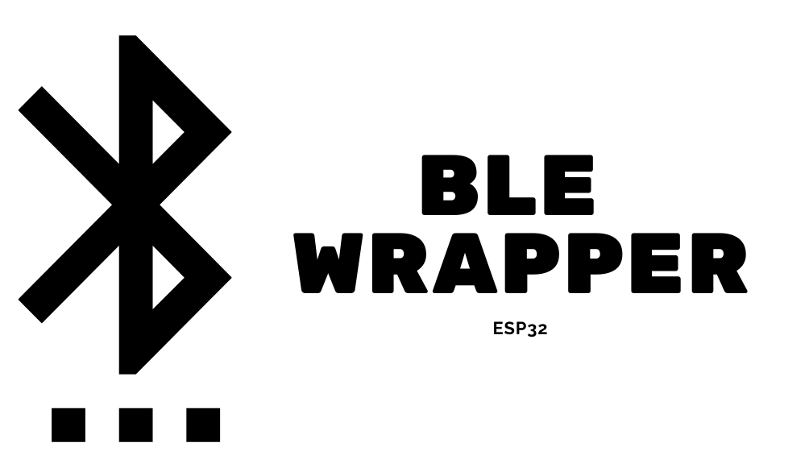

## Overview 
• A wrapper around the Bluetooth Low Energy protocol for the ESP32 microcontroller.

• Originally it was part of another [project](https://github.com/Pedro4064/Flexivel) of mine, so if previous versions are necessary, you may visit
its git history on the other directory.

## Topics:
•[Public Methods](#public-methods)

•[Public Variables](#public-variables)

•[Private Methods](#private-methods)

•[Static Members](#static-members)

•[Examples](#examples)


## Public Methods
1. [setDeviceName](#1-setdevicename)
2. [add_characteristic](#2-add_characteristic)
3. [use_characteristic](#3-use_characteristic)
4. [begin](#4-begin)
5. [receivedDataAsIntArray](#5-receiveddataasintarray)
6. [receivedDataAsDoubleArray](#6-receiveddataasdoublearray)
7. [receivedDataAsFloatArray](#7-receiveddataasfloatarray)
8. [receivedDataAsString](#8-receiveddataasstring)
9. [sendDataArray](#9-senddataarray)
10. [sendDataPoint](#10-senddatapoint)
11. [releaseMemoryToSystem](#11-releasememorytosystem)


### 1. setDeviceName

##### Method Definition
```c++
void setDeviceName(std::string name);
```
##### Method Description 
• It takes an `std::string` and sets it as the name which the bluetooth device will be discoverable by other devices.


### 2. add_characteristic

##### Method Definition
```c++
void add_characteristic(String characteristic_name, const char* uuid);
```
##### Method Description 
• It takes the characteristic name (used for future reference) as a `String` and the UUID as a `const char*`.
Both are stored in a map structure with the characteristic_name as the key and the uuid as the value.


### 3. use_characteristic

##### Method Definition
```c++
void use_characteristic(String characteristic_name);
```
##### Method Description 
• Changes the working UUID to the one referenced by the `String` key `characteristic_name` passed as
referenced.


### 4. begin
##### Method Definition
```c++
void begin();
```
##### Method Description 
• It sets up and initializes the whole Bluetooth low energy server and characteristic callbacks with the following UUIDs:

|data type| variable | value |
|---------|----------|-------|
|`const char*`|SERVICE_UUID|`ab0828b1-198e-4351-b779-901fa0e0371e`|


### 5. receivedDataAsIntArray
##### Method Definition
```c++
int* receivedDataAsIntArray();
```
##### Method Description 
• Retrieves the last data passed by the other device as a pointer to an int array.
• If there is no data to be processed it will return a `NULL` pointer*.
• It is highly recommended that you check rather the response was a null pointer before doing any data processing, to avoid errors and exceptions. 


### 6. receivedDataAsDoubleArray
##### Method Definition
```c++
float* receivedDataAsDoubleArray();
```
##### Method Description 
• Retrieves the last data passed by the other device as a pointer to an array of doubles.
• If there is no data to be processed it will return a `NULL` pointer*.
• It is highly recommended that you check rather the response was a null pointer before doing any data processing, to avoid errors and exceptions.


### 7. receivedDataAsFloatArray
##### Method Definition
```c++
float* receivedDataAsFloatArray();
```
##### Method Description 
• Retrieves the last data passed by the other device as a pointer to a float array.
• If there is no data to be processed it will return a `NULL` pointer*.
• It is highly recommended that you check rather the response was a null pointer before doing any data processing, to avoid errors and exceptions.


### 8. receivedDataAsString
##### Method Definition
```c++
String receivedDataAsString();
```
##### Method Description 
• Retrieves the last data passed by the other device as a `String`.


### 9. sendDataArray
##### Template Method Definition
```c++
template <typename T>
void sendDataArray(T data[], int array_size){...}
```
##### Method Description 
• A template method that converts an array of any data type into a CSV formatted c string(`char*`) and sends it via BLE.


### 10. sendDataPoint
##### Template Method Definition
```c++
template <typename T>
void sendDataPoint(T data_point){...}
```
##### Method Description 
• A template method that converts a value of any data type into a c string(`char*`) and sends it via BLE.


### 11. releaseMemoryToSystem
##### Template Method Definition
```c++
template <typename T>
void static releaseMemoryToSystem(T* data){...}
```
##### Method Description 
• A template method that takes a pointer to an array that was allocated dynamically, and releases the memory back to the system.


## Public Variables
• The only public variable is a custom datatype(struct) used to store all the information related to the received data, that will be used to parse and convert it.
```c++
// Create struct that will hold all essential infromation about the parsed data 
struct data_information{

    int array_size;
    std::string* data_array;

};
```


## Private Methods

•The only private method is the parsing algorithm. It takes the incoming `std::string` data in a CSV format and splits the data points into an array of `std::strings`. It return the struct containing the size of the array and the array itself.
•Since this method is private it cannot be accessed by the end user, and it's used inside other methods (e.g [receiveDataAsIntArray](#3-receiveddataasintarray))

#### Method definition 
```c++
BLE::data_information parseData(std::string data);
```


## Static members 
• A static member is a variable or a method that can be accessed without having the need to instantiate the class nor use an object. Furthermore, it is common to all instances of the class (i.e They share the same variable).
#### 1. deviceConnected 
• `bool` variable that is `true` when there is a device connected via BLE, or `false` when there is no device.

##### Using it
```c++
// If there is a device connected 
if (Bluetooth::BLE::deviceConnected){...}

// If there is no device...
else{...}
```

#### 2. new_message 
• `bool` variable that is `true` when there is an unread message and `false`otherwise.

##### Using it
```c++
// If there is a new message 
if (Bluetooth::BLE::new_message){...}

// If there is no new messages...
else{...}

```

## Examples

```c++
// Include the .h file 
#inlude "BLE.h"

// instantiate an object 
Bluetooth::BLE bluetooth;

void setUp(){

    // initialize the serial monitor 
    Serial.begin(115200);

    // Add the characteristics that will be used 
    bluetooth.setDeviceName("Pedro's RunPod"); 
    bluetooth.add_characteristic("Angle", "fbed8ddc-109f-11eb-adc1-0242ac120002");
    bluetooth.add_characteristic("Time", "16dc549c-10a1-11eb-adc1-0242ac120002");

    // Initialize the BLE 
    bluetooth.begin();
}

void loop(){

    delay(1000);
  
    //If a device connected to the ESP32, begin the processes, otherwise keep scanning.
    if(Bluetooth::BLE::deviceConnected )
    {
        log("Device connected!!"); 

        // Counter that send every odd number to the Angle characteristic and every even to the Time characteristic
        int i = 0;
        while(true){
            i++;
            if(i%2 == 0){
                bluetooth.use_characteristic("Angle"); // Change to the specific characteristic     
            }
            else{
                bluetooth.use_characteristic("Time"); // Change to the specific characteristic 
            }

            // Send the value of i and notify
            bluetooth.sendDataPoint(i);
            delay(500);
        }
    }
}
```